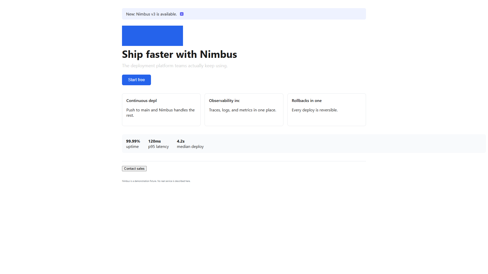

# Benchmark Harness

Measures whether the gui-playtest-loop skill actually finds injected bugs,
without letting the agent see ground truth.

Full reference: [`../reference/benchmark.md`](../reference/benchmark.md)

## Quick start

```bash
python benchmark/harness/seed_golden.py
python benchmark/harness/run_benchmark.py --source golden
python -m unittest discover -s benchmark/harness/tests -v
```

## Layout

```text
benchmark/
├── catalog.json           fixture registry (6 fixtures: 1 control, 4 injected, 1 trap)
├── fixtures/<id>/         agent-visible: app.html + goal.json
├── truth/<id>.json        ground truth — NEVER put in agent workspace
├── golden/<id>/           reference reports for CI
├── harness/               serve, score, run_benchmark, run_autofix_loop, agent_runner
├── runs/<id>/             live playtest evidence
└── results/<ts>/          scored output + manifest
```

## Fixtures (v1)

| ID | Class | Split | What breaks |
|----|-------|-------|-------------|
| `memory-clean-control` | control | train | nothing — reference; the probe must stay silent on it |
| `memory-dead-start-button` | injected | train | Start handler commented out |
| `memory-mismatch-stays-visible` | injected | train | mismatch never flips back |
| `form-loses-data-on-validation` | injected | train | form clears fields on error |
| `dashboard-fake-filter` | injected | held-out | filter UI fakes change |
| `trap-overlay-blocks-clicks` | trap | held-out | invisible overlay blocks clicks |
| `landing-visual-defects` | injected | held-out | behavior works, surface carries 7 measured visual defects |

## Verified probe behaviour

`scripts/ux_probe.js` was run in a real browser against these fixtures:

| Fixture | Result |
|---|---|
| `memory-clean-control` | **0 findings** — no false positives |
| `landing-visual-defects` | 9 rules, 6 blockers, every one confirmed in the screenshot |
| `trap-overlay-blocks-clicks` | `occluded-interactive` blocker on 8 cards, naming `#click-shield` |

The trap result matters: the probe found a *behavior* trap through pure visual
measurement, independently of the interaction playtest.



Every measured finding is visible in that capture: the subtitle is invisible
against white, all three card titles are cut off mid-word, the logo is
stretched from a square source, the metrics strip runs off the right edge, and
the Contact sales button is still browser-default chrome.

An earlier revision of the probe reported **17 blocker findings on the clean
control** — it flagged face-down cards (`color: transparent`) and the disabled
Restart button as unreadable. That run is why the probe now skips deliberately
hidden text and disabled controls, and why `forbid_ux_findings` exists as a
scored property rather than a comment.

## Spike result (memory-dead-start-button)

**Result:** PASS — detection recall 1.00, precision 1.00

Pipeline verified end-to-end:

1. `serve.py` serves fixture at `http://127.0.0.1:8765/app.html`
2. Playtester observes Start does nothing, cards stay hidden
3. `validate_evidence.py` accepts the evidence package
4. `score.py` matches report against truth manifest

Results: `benchmark/results/20260730T110741Z/`

## Run a spike manually

Terminal 1:

```bash
python benchmark/harness/serve.py --fixture memory-dead-start-button
```

Terminal 2 — run playtester (browser MCP, or read `prompts/playtester.md`), write evidence to:

```text
benchmark/runs/memory-dead-start-button/round-1/
  report.json
  action.log
  screenshots/
```

Terminal 3 — score:

```bash
python benchmark/harness/run_spike.py \
  --fixture memory-dead-start-button \
  --round-dir benchmark/runs/memory-dead-start-button/round-1
```

## Headless agent status

| CLI | Result |
|-----|--------|
| `codex exec` | Try `agent_runner.py` with `-c features.multi_agent_v2=false` |
| `claude -p` | Blocked when credit balance too low |

The deterministic harness works. Fully automated benchmark loops need a
working headless agent CLI with browser MCP access. Until then, run
playtester via IDE browser tools and pipe results through `run_spike.py`.
